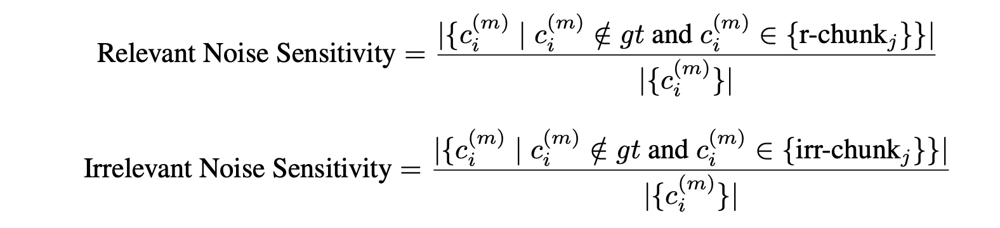

- [draft 如何评估RAG系统](#draft-如何评估rag系统)
  - [出发点](#出发点)
  - [指标体系与框架](#指标体系与框架)
    - [海选](#海选)
      - [1. **RAGAS**\*](#1-ragas)
      - [2. RAGChecker](#2-ragchecker)
      - [3. DeepEval](#3-deepeval)
    - [RAGAS指标](#ragas指标)
      - [评估依赖的数据类型（输入）](#评估依赖的数据类型输入)
      - [所选指标概览](#所选指标概览)
      - [Faithfullness\*](#faithfullness)
        - [计算步骤和prompt示例](#计算步骤和prompt示例)
      - [Answer Relevance\*](#answer-relevance)
        - [计算步骤和prompt示例](#计算步骤和prompt示例-1)
      - [Context Relevance\*](#context-relevance)
        - [计算步骤和prompt示例](#计算步骤和prompt示例-2)
      - [Context Precision\*](#context-precision)
        - [通用计算公式理解](#通用计算公式理解)
        - [LLM-Based 和 Non LLM-Based 的不同](#llm-based-和-non-llm-based-的不同)
      - [Context Recall](#context-recall)
        - [LLM-Based 计算](#llm-based-计算)
        - [Non LLM-Based 计算](#non-llm-based-计算)
      - [Noise Sensitivity (Relevant)](#noise-sensitivity-relevant)
        - [计算步骤](#计算步骤)
      - [Factual Correctness](#factual-correctness)
        - [计算步骤](#计算步骤-1)
      - [Semantic similarity](#semantic-similarity)
        - [计算步骤](#计算步骤-2)
    - [其他传统指标 (Optional Todo)](#其他传统指标-optional-todo)
  - [数据集（TODO）](#数据集todo)


# draft 如何评估RAG系统

## 出发点

个人从以下两个方面出发：
- 指标体系与框架：有哪些指标？有哪些evaluation框架？
- 数据集：用什么样的数据？怎么准备和使用？

## 指标体系与框架

总的来说各框架对RAG的评估指标大同小异。

### 海选

#### 1. **RAGAS***
- https://github.com/explodinggradients/ragas, 7.1k stars
- Paper: https://arxiv.org/abs/2309.15217
- 以评估RAG为主的开源框架
  - evaluation 流程大体思路跟我们当初那个简约框架相似
  - 数据称为 evaluation sample 和 evaluation dataset
  - 分为 SingleTurnSample 和 MultiTurnSample 
- 也包括LLM应用的其他部分如agent/tool use、自然语言理解、SQL生成等任务的评估

#### 2. RAGChecker
- https://github.com/amazon-science/RAGChecker, 515 stars
- Paper: https://arxiv.org/abs/2408.08067
- 只评估RAG的框架
- LlamaIndex的文档有简单的集成使用例子

#### 3. DeepEval
- https://github.com/confident-ai/deepeval, 3.5k stars
- 相对更综合的LLM应用评估框架（其中包含RAGAS）
  - evaluation 流程大体思路也相似
  - 以DataSet中的Test Cases的形式进行评估
  - 不过更进一步分 LLM Test Case, Conversational Test Case, MLLM Test Case (Multimodal)
- LlamaIndex的文档有简单的集成使用例子


主要看了RAGAS的论文以及框架文档中对指标的描述，以理解各指标的含义。

至于最终使用哪个框架、或者不用框架自己实现，可以后面根据实际情况选择。

### RAGAS指标

结合论文与文档，选出以下相对优先的指标。

#### 评估依赖的数据类型（输入）
- query : 也作question，问题
- retrieved context：检索到的上下文，以下简称context
- answer: llm最终生成的回答
- reference (ground truth)：参考答案、正确答案，人工标注的数据
- reference contexts：参考上下文、正确的上下文，人工标注的数据

#### 所选指标概览

说明
- `#`: 带`#`的是论文中描述的指标
- `^`: 带`^`的是框架文档中实现的指标
- 取值范围：除了Answer Relevance是[-1, 1]，其他指标都是[0, 1]。
- 数值解读：除了Noise Sensitivity是越低越好，其他指标都是越高越好。

| 指标                                | -    | 考察点                                    | 输入                              | 评估模块 | 需要LLM | 需要人工标注 |
| ----------------------------------- | ---- | ----------------------------------------- | --------------------------------- | -------- | ------- | ------------ |
| **Faithfullness**                   | `#^` | 回答应在上下文中找到支持（无编造）        | query, answer, context            | 生成     | √       | x            |
| **Answer Relevance**                | `#^` | 回答要紧扣问题核心（完整、无冗余）        | query, answer                     | 生成     | √       | x            |
| **Context Relevance**               | `#`  | 检索到的上下文应包含问题所需信息且无冗余  | query, context                    | 检索     | √       | x            |
| ***Context Precision (LLM-Based)*** | `^`  | 检索结果中相关的上下文要多、且排在前面    | query, context                    | 检索     | √       | x            |
| Context Precision (Non LLM)         | `^`  | 检索结果中相关的上下文要多、且排在前面    | query, context, reference         | 检索     | x       | √            |
| Context Recall  (LLM-Based)         | `^`  | 检索结果中包含了得到真实答案的足够信息    | context, reference                | 检索     | √       | √            |
| Context Recall  (Non LLM)           | `^`  | 检索结果中包含了得到真实答案的足够信息    | context, reference contexts       | 检索     | √       | √            |
| Noise Sensitivity (Relevant)        | `^`  | RAG系统使用相关上下文时生成错误回答的频率 | query, answer, context，reference | 整体     | √       | √            |
| Factual Correctness                 | `^`  | 回答的要点是否和参考答案一致              | answer, reference                 | 整体     | √       | √            |
| Semantic similarity                 | `^`  | 回答是否和参考答案语义相似                | answer, reference                 | 整体     | x       | √            |


#### Faithfullness*

回答需要在上下文中找到支持（无编造）。
- https://docs.ragas.io/en/stable/concepts/metrics/available_metrics/faithfulness/
- 输入：query, answer, context 

##### 计算步骤和prompt示例
1. 把长答案拆分成多个要点 (s1, s2, s3, ...)
```
Given a question and answer, create one or more statements from each sentence in the given answer.
question: [question]
answer: [answer]
```

2. 对每个要点，判断是否能从上下文中找到支持
```
Consider the given context and following statements, then determine whether they are supported by the information present in the context. 
Provide a brief explanation for each statement before arriving at the verdict (Yes/No). 
Provide a final verdict for each statement in order at the end in the given format. 
Do not deviate from the specified format.
statement: [statement 1]
...
statement: [statement n]
```

3. 计算Faithfullness

f = 有支持的要点数 / 总要点数


#### Answer Relevance*

回答要紧扣问题核心（完整、无冗余）。答案不完整或者包含冗余信息，则会降低这个指标。
- https://docs.ragas.io/en/stable/concepts/metrics/available_metrics/answer_relevance/
- 输入：query, answer, (context)
  - 注：文档的描述和示例中要提供context，但原理描述中没有context


##### 计算步骤和prompt示例

1. 先反过来，根据回答案，生成多个可能的问题
```
Generate a question for the given answer.
answer: [answer]
```

2. 对每个生成的问题进行embedding，计算与原问题的cosine相似度，最后取均值作为答案相关性

ar = (1/n) * Σ sim(q, qi) = 原问题与所有生成问题的平均相似度


#### Context Relevance*

检索到的上下文应包含问题所需信息且无冗余。

- 输入：query, context


##### 计算步骤和prompt示例
1. 让llm从context中提取与问题相关的句子。
```
Please extract relevant sentences from the provided context that can potentially help answer the following question. 
If no relevant sentences are found, or if you believe the question cannot be answered from the given context, return the phrase "Insufficient Information". 
While extracting candidate sentences you’re not allowed to make any changes to sentences from given context.
```

2. 提取出的相关句数与context总句数的比值即为Context Relevance

context_relevance = 相关句数 / 总句数


#### Context Precision*

检索结果中相关的上下文要多、且排在前面。（惩罚为生成模块提供一堆无关context的行为。）
- https://docs.ragas.io/en/stable/concepts/metrics/available_metrics/context_precision/

- 输入
  - LLM-Based：query, context
  - Non LLM-Based：query, context, reference
  
##### 通用计算公式理解

- precision@k = top k检索结果中的判定为相关上下文的数目 / k
  
- context_precision@K = (Σ precision@k * Vk) / N
  - Vk: relevance indicator at rank k (??)
  - N: top K检索结果中被判定为相关上下文的数目

*有点疑惑，要看ragas中具体实现的代码。*

##### LLM-Based 和 Non LLM-Based 的不同

- LLM-Based：直接用LLM判断context是否与query相关
- Non LLM-Based：用传统方式计算 context 和 reference 的distance measure，从而判断context是否与query相关

#### Context Recall

检索结果中包含了得到真实答案的足够信息。
- https://docs.ragas.io/en/stable/concepts/metrics/available_metrics/context_recall/

- 输入
  - LLM-Based: context, reference
    - 文档描述中要query， 示例中还要输入answer
  - Non LLM-Based: context, reference contexts

##### LLM-Based 计算

1. 用 LLM 提取 reference 中的要点数 m
2. 用 LLM 判断在 context 中能找到支持依据的要点数 n

context_recall = n / m

个人注：
- 和Faithfullness有点类似，都是计算被context支持的要点数占比。
- 但Faithfullness是判断answer中要点的支持情况，而Context Recall是判断reference中要点的支持情况。

##### Non LLM-Based 计算

1. 用传统方法（string comparison）计算各 context 和 reference contexts 的 distance measure，从而判断某个context是否是相关的

context_recall = 检索到的相关上下文数目 / reference contexts 中的总上下文数目


#### Noise Sensitivity (Relevant)

系统是否容易受不相关的上下文影响
- https://docs.ragas.io/en/stable/concepts/metrics/available_metrics/noise_sensitivity/
- 这个指标首发于RagChecker，它论文里描述比ragas文档更准确详细一点
- 分别有 relevant noise sensitivity 和 irrelevant noise sensitivity
  - 先考虑 relevant noise sensitivity
- 输入：query, answer, context，reference

##### 计算步骤

1. 找出检索到的上下文（context）中能得到参考答案（reference）的相关上下文集合（relevant context）
2. 提取出生成的回答（answer）中的所有要点（claims）集合 total
3. 找出能在相关上下文集合（relevant context）中找到支持的要点集合 m
4. 找出不能在参考答案（reference）支持的要点集合 n
5. 计算noise sensitivity = (n 和 m 的交集元素数目) / (total 的元素数目)




#### Factual Correctness

回答的要点是否和参考答案一致（正确）。具体有precision、recall、f1。
- https://docs.ragas.io/en/stable/concepts/metrics/available_metrics/factual_correctness/
- 输入：answer, reference

##### 计算步骤

1. 把生成的回答（answer）和参考答案（reference）分别拆分成多个要点
2. 判断生成回答中的每个要点是否命中，计算precision、recall、f1

- TP: 生成的回答中的要点在参考答案中找到了
- FP: 生成的回答中的要点在参考答案中没找到
- FN: 参考答案中的要点在生成的回答中没找到

- precision = TP / (TP + FP)
- recall = TP / (TP + FN)
- f1 = 2 * precision * recall / (precision + recall)


#### Semantic similarity 

回答是否和参考答案语义相似 

- https://docs.ragas.io/en/stable/concepts/metrics/available_metrics/semantic_similarity/
- 输入：answer, reference

##### 计算步骤

1. 用embedding model计算生成的回答（answer）的向量
2. 用同一embedding model计算参考答案（reference）的向量
3. 计算两个向量的cosine similarity，即为语义相似度

### 其他传统指标 (Optional Todo)

一些用来评估检索系统和推荐系统的指标，如 MRR、Hits Rate、NDCG 等，应该也可以用来评估RAG中的检索模块，但基本都需要人工标注的数据。不优先考虑。

计算文本相似度的指标，如 Rouge-L、BLEU、Jaccard 等，应该也可以用来评估e2e的结果，但估计需要人工标注的数据。不优先考虑。


## 数据集（TODO）

Q1. 我们有自己的数据集吗？
无。

Q2. 有公开的数据集吗？其中有适合我们的数据吗？如何利用？

Q3. 能不能利用合成数据集？如何准备合成数据集？


